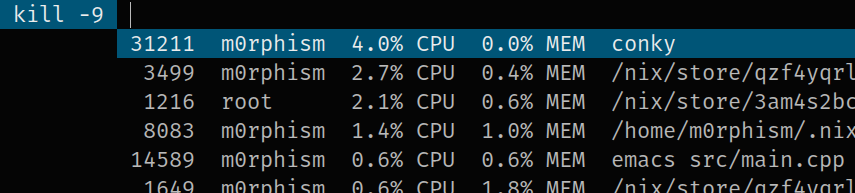

# haskell-dmenu-pkill
dmenu script for killing applications. Can be sorted by process id or CPU/Memory usage.

Requirements:
[dmenu](http://tools.suckless.org/dmenu/) or
[dmenu2](https://bitbucket.org/melek/dmenu2), and
the linux tools `ps` and `kill` must be installed.

Installation:
  Either get the sources from this repository, or
  [from hackage](https://hackage.haskell.org/package/dmenu-pkill).

Usage:

*   `dmenu-pkill [OPTIONS]`

    Spawns a dmenu process to let the user select processes to kill with `kill -9`.

Options:

*   `-cpu`

    Sort processes by CPU usage as displayed with `ps`.
*   `-mem`

    Sort processes by memory usage as displayed with `ps`.
*   `-pid`

    Sort processes by process id (default).

The application is build with the
[dmenu Haskell bindings](https://hackage.haskell.org/package/dmenu), which
support customizing the dmenu commandline options in a configuration file.
